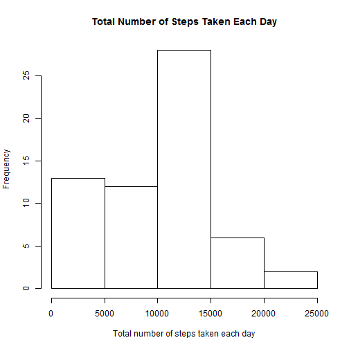
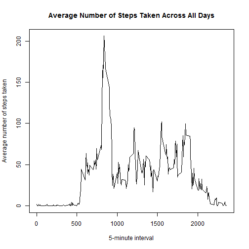
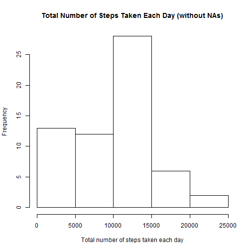
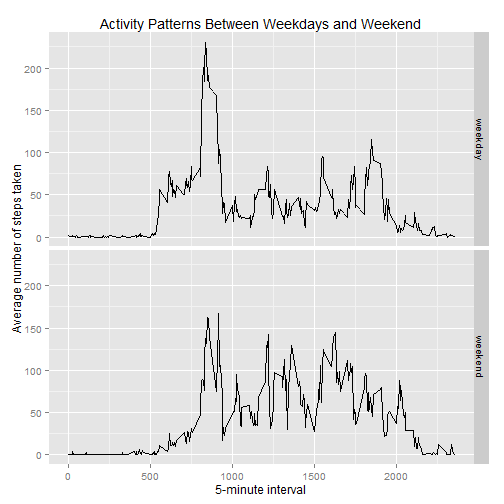

## Loading and preprocessing the data

```r
#Load the data.
raw_data <- read.csv("activity.csv")
str(raw_data)
```

```
## 'data.frame':	17568 obs. of  3 variables:
##  $ steps   : int  NA NA NA NA NA NA NA NA NA NA ...
##  $ date    : Factor w/ 61 levels "2012-10-01","2012-10-02",..: 1 1 1 1 1 1 1 1 1 1 ...
##  $ interval: int  0 5 10 15 20 25 30 35 40 45 ...
```


## What is mean total number of steps taken per day?

```r
suppressMessages(library(dplyr))
#Calculate the total number of steps taken per day.
data <- group_by(raw_data, date) %>% 
    summarise(total_steps = sum(steps, na.rm = TRUE))
str(data)
```

```
## Classes 'tbl_df', 'tbl' and 'data.frame':	61 obs. of  2 variables:
##  $ date       : Factor w/ 61 levels "2012-10-01","2012-10-02",..: 1 2 3 4 5 6 7 8 9 10 ...
##  $ total_steps: int  0 126 11352 12116 13294 15420 11015 0 12811 9900 ...
##  - attr(*, "drop")= logi TRUE
```

```r
#Make a histogram of the total number of steps taken each day.
hist(data$total_steps, 
     main = "Total Number of Steps Taken Each Day", 
     xlab = "Total number of steps taken each day")
```

 

```r
#Calculate the mean and median of the total number of steps taken per day.
mean(data$total_steps)
```

```
## [1] 9354.23
```

```r
median(data$total_steps)
```

```
## [1] 10395
```


## What is the average daily activity pattern?

```r
suppressMessages(library(dplyr))
data <- group_by(raw_data, interval) %>% 
    summarise(avg_steps = mean(steps, na.rm = TRUE))
str(data)
```

```
## Classes 'tbl_df', 'tbl' and 'data.frame':	288 obs. of  2 variables:
##  $ interval : int  0 5 10 15 20 25 30 35 40 45 ...
##  $ avg_steps: num  1.717 0.3396 0.1321 0.1509 0.0755 ...
##  - attr(*, "drop")= logi TRUE
```

```r
#Make a time series plot.
plot(data$interval, data$avg_steps, type = "l",
     main = "Average Number of Steps Taken Across All Days",
     xlab = "5-minute interval",
     ylab = "Average number of steps taken")
```

 

```r
#Show 5-minute interval, on average across all the days in the dataset, 
#contains the maximum number of steps.
data[which(data$avg_steps == max(data$avg_steps)), 1:2]
```

```
## Source: local data frame [1 x 2]
## 
##   interval avg_steps
## 1      835  206.1698
```


## Imputing missing values

```r
detach("package:dplyr", unload = TRUE)
suppressMessages(library(plyr))
suppressMessages(library(dplyr))
#Calculate the total number of rows with NAs.
sum(is.na(raw_data$steps))
```

```
## [1] 2304
```

```r
#Fill in all of the missing values in the dataset with the mean that 5-minute 
#interval. And then create a new dataset that is equal to the original dataset, 
#but with the missing data filled in.
raw_data[raw_data$interval == 5 & is.na(raw_data$steps), ]
```

```
##       steps       date interval
## 2        NA 2012-10-01        5
## 2018     NA 2012-10-08        5
## 8930     NA 2012-11-01        5
## 9794     NA 2012-11-04        5
## 11234    NA 2012-11-09        5
## 11522    NA 2012-11-10        5
## 12674    NA 2012-11-14        5
## 17282    NA 2012-11-30        5
```

```r
m <- mean(raw_data[raw_data$interval == 5, 1], na.rm = T)
impute.mean <- function(x) replace(x, is.na(x), mean(x, na.rm = TRUE))
data <- ddply(raw_data, ~ interval, transform, steps = impute.mean(steps))   
data[data$interval == 5 & data$steps == m, ]
```

```
##         steps       date interval
## 62  0.3396226 2012-10-01        5
## 69  0.3396226 2012-10-08        5
## 93  0.3396226 2012-11-01        5
## 96  0.3396226 2012-11-04        5
## 101 0.3396226 2012-11-09        5
## 102 0.3396226 2012-11-10        5
## 106 0.3396226 2012-11-14        5
## 122 0.3396226 2012-11-30        5
```

```r
data_grouped <- group_by(raw_data, date) %>% 
    summarise(total_steps = sum(steps, na.rm = TRUE))
```

```r
#Make a histogram of the total number of steps taken each day.
hist(data_grouped$total_steps, 
     main = "Total Number of Steps Taken Each Day (without NAs)", 
     xlab = "Total number of steps taken each day")
```

 

```r
#Calculate the mean and median total number of steps taken per day.
mean(data_grouped$total_steps)
```

```
## [1] 9354.23
```

```r
median(data_grouped$total_steps)
```

```
## [1] 10395
```

```r
#Do these values differ from the estimates from the first part of 
#the assignment? 
#[Ans] These values are same as the first part of the assignment.
#What is the impact of imputing missing data on the estimates of 
#the total daily number of steps?
#[Ans] Imputing missing data does not show significant impact.
```


## Are there differences in activity patterns between weekdays and weekends?

```r
#Use the dataset with the filled-in missing values for this part.
str(data)
```

```
## 'data.frame':	17568 obs. of  3 variables:
##  $ steps   : num  1.72 0 0 47 0 ...
##  $ date    : Factor w/ 61 levels "2012-10-01","2012-10-02",..: 1 2 3 4 5 6 7 8 9 10 ...
##  $ interval: int  0 0 0 0 0 0 0 0 0 0 ...
```

```r
#Create a new factor variable in the dataset with two levels: 'weekday', 
#'weekend' indicating whether a given date is a weekday or weekend day.
suppressMessages(library(lubridate))
suppressMessages(library(dplyr))
suppressMessages(library(chron))
suppressMessages(library(ggplot2))
data <- mutate(data, 
    day_type = factor(ifelse(is.weekend(ymd(date)), "weekend", "weekday")))
str(data)
```

```
## 'data.frame':	17568 obs. of  4 variables:
##  $ steps   : num  1.72 0 0 47 0 ...
##  $ date    : Factor w/ 61 levels "2012-10-01","2012-10-02",..: 1 2 3 4 5 6 7 8 9 10 ...
##  $ interval: int  0 0 0 0 0 0 0 0 0 0 ...
##  $ day_type: Factor w/ 2 levels "weekday","weekend": 1 1 1 1 1 2 2 1 1 1 ...
```

```r
#Make a panel plot containing a time series plot.
data.grouped <- group_by(data, interval, day_type) %>% 
    summarise(avg_steps = mean(steps, na.rm = TRUE))
qplot(interval, avg_steps, data = data.grouped, 
      geom = "line", facets = day_type ~ .) +
    xlab("5-minute interval") +
    ylab("Average number of steps taken") +
    ggtitle("Activity Patterns Between Weekdays and Weekend")
```

 


## Ref.:
- [How to substitute missing values by the group means](https://www.mail-archive.com/r-help@r-project.org/msg58289.html)
